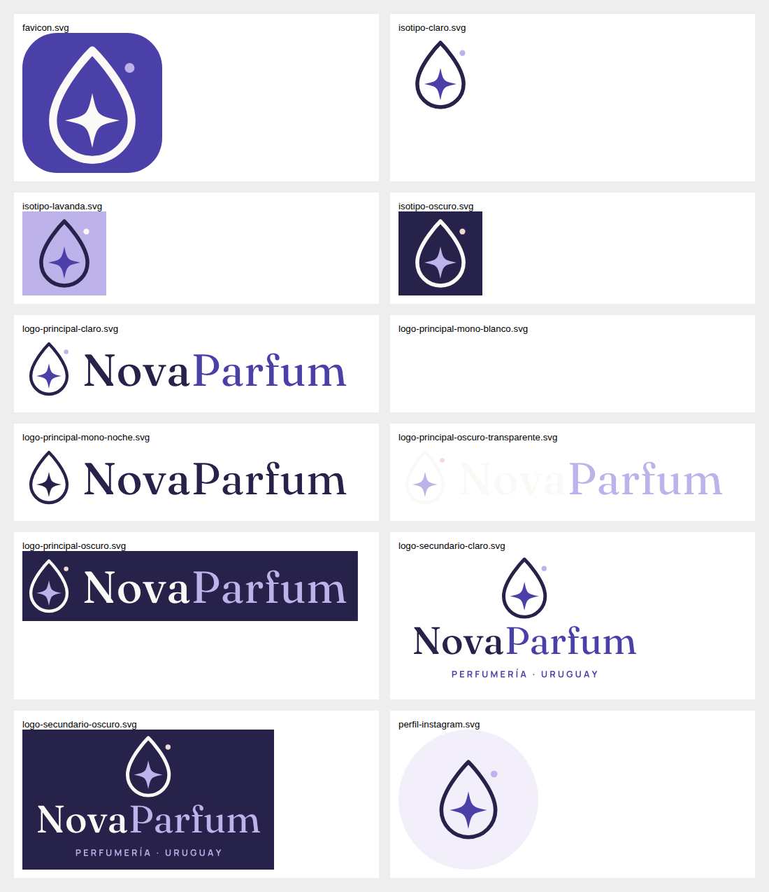

# Identidad de marca — NovaParfum

## 1. Concepto
**"Nova"** es una estrella que de pronto brilla más fuerte. NovaParfum es ese momento en que alguien
descubre la fragancia que lo hace sentirse más visible, más él o ella. El símbolo une las dos ideas:
**una gota de perfume con una estrella de cuatro puntas adentro** — la esencia que se enciende.

Identidad visual: **índigo nocturno + lavanda + marfil**, con acentos rosa polvo y salvia.
Se descartó deliberadamente la combinación dorado + negro (cliché del rubro, poco diferenciadora y
asociada a tiendas genéricas). El índigo transmite noche, misterio y calidad; la lavanda, cercanía y
modernidad; el marfil, limpieza y aire.

## 2. Personalidad
| Es | No es |
|---|---|
| Cálida, experta sin pedantería | Snob, inalcanzable |
| Moderna, clara, directa | Recargada, ruidosa |
| Confiable (dice la verdad sobre stock, plazos y precios) | Agresiva ("¡¡ÚLTIMAS HORAS!!") |
| Sensorial (habla de notas, momentos, sensaciones) | Técnica o fría |

Arquetipo: **La Guía Sensorial** (mezcla de "Sabio" y "Amante"): te ayuda a elegir y te hace sentir bien.

## 3. Misión, visión y valores
- **Misión:** acercar perfumes originales a todo Uruguay con una compra simple, segura y bien asesorada.
- **Visión:** ser la perfumería online de referencia en Uruguay por confianza, curaduría y experiencia de compra.
- **Valores:**
  1. **Autenticidad** — solo productos originales de proveedores verificados.
  2. **Claridad** — precios, plazos y estados del pedido siempre visibles.
  3. **Curaduría** — elegimos, no acumulamos.
  4. **Cercanía** — atención humana por WhatsApp.
  5. **Cuidado** — packaging prolijo, datos del cliente protegidos.

## 4. Público objetivo
| Segmento | Perfil | Qué busca | Mensaje clave |
|---|---|---|---|
| **Principal** | 20–40 años, Montevideo y área metropolitana + capitales del interior, compra desde el celular, usa Mercado Pago | Perfumes de tendencia (incluye árabes/nicho accesible), buen precio, confianza | "Original, con envío y en cuotas con Mercado Pago" |
| **Regalo** | 25–55 años, compra para otra persona | Acierto, presentación, entrega a tiempo | "Regalá seguro: te ayudamos a elegir" |
| **Coleccionista** | Entusiasta de fragancias, TikTok/Instagram | Novedades, notas, comparaciones | "Lo nuevo, primero en NovaParfum" |

## 5. Posicionamiento
> Para quienes quieren perfumes originales sin vueltas, **NovaParfum** es la perfumería online uruguaya
> que combina **curaduría y compra en 2 toques con Mercado Pago**, con seguimiento del pedido en todo momento.

Lugar en el mercado: **premium accesible** — estética de marca de lujo, precios y lenguaje de tienda cercana.

## 6. Eslogan
- Principal: **"Tu esencia, en nueva luz."**
- Alternativos (campañas): "Encontrá tu fragancia." · "Una nueva estrella en tu piel." · "Oler bien, sin vueltas."

## 7. Tono de comunicación
- **Voseo uruguayo** ("elegí", "pagá", "seguí tu pedido"), frases cortas, sin tecnicismos.
- Emojis con moderación y siempre los mismos: ✨ (novedad), 📦 (envío), 💜 (cierre afectivo).
- Prohibido: mayúsculas gritadas, "¡¡!!", urgencia falsa, promesas que no controlamos (plazos exactos del correo).

| Situación | ✅ Así | ❌ Así no |
|---|---|---|
| Lanzamiento | "Llegó Aurora Nocturna ✨ ámbar, vainilla y un toque de azafrán." | "¡¡NUEVO PERFUME INCREÍBLE COMPRÁ YA!!" |
| Envío | "¡Tu pedido ya fue enviado! 📦 Seguilo con este número: …" | "Su pedido ha sido despachado." |
| Error | "Uy, ese tamaño se agotó. ¿Te avisamos cuando vuelva?" | "Producto sin stock." |

## 8. Paleta de colores (contraste verificado WCAG)
| Nombre | HEX | Uso | Contraste |
|---|---|---|---|
| **Noche Índigo** | `#26224A` | Texto principal, fondos oscuros, footer | 14.2:1 sobre Marfil |
| **Iris** | `#4B3FA8` | Botones, links, acento del logo | 8.2:1 con texto blanco |
| **Lavanda Nova** | `#BDB2EA` | Acentos, ilustraciones, fondos de categoría | 7.6:1 con Noche |
| **Bruma** | `#F2EFFA` | Superficies suaves, secciones alternadas | 13.1:1 con Noche |
| **Marfil** | `#FBF9F6` | Fondo general | — |
| **Rosa Polvo** | `#F1DAD5` | Degradés, categoría Mujer, packaging | 11.2:1 con Noche |
| **Salvia** | `#B9CBB8` | Acento fresco, categoría Ofertas | 8.7:1 con Noche |
| **Piedra** | `#5E5A70` | Texto secundario | 6.3:1 sobre Marfil |
| **Frambuesa** | `#A8324A` | Solo precios rebajados y badges de descuento | 6.5:1 con blanco |

Proporción recomendada: 60 % Marfil/Bruma · 25 % Noche · 10 % Iris · 5 % acentos.
Degradé de marca: `linear-gradient(160deg, #F2EFFA 0%, #F1DAD5 100%)`.

## 9. Tipografías (gratuitas, licencia SIL OFL)
- **Fraunces** (serif con carácter, peso 400–500): títulos, nombres de perfume, logo.
- **Manrope** (sans geométrica, 400–800): textos, botones, precios, UI.
- En la tienda están **autoalojadas en el CDN de Shopify** (sin pedir fuentes a Google → más rápido y privado).
- Escala web: H1 30–52 px · H2 24–38 px · cuerpo 16 px · etiquetas 12 px en mayúsculas con 0.14 em de espaciado.

## 10. Logos
Archivos en `branding/logo/` (SVG con **texto convertido a curvas**; se regeneran con `python3 branding/generate_logos.py`).

| Archivo | Uso |
|---|---|
| `logo-principal-claro.svg` | Web, emails, documentos (fondos claros) |
| `logo-principal-oscuro.svg` / `-transparente` | Fondos Noche o fotos oscuras |
| `logo-principal-mono-noche.svg` / `-mono-blanco.svg` | Sellos, grabados, una tinta |
| `logo-secundario-claro/oscuro.svg` | Versión apilada con "PERFUMERÍA · URUGUAY": packaging, tarjetas |
| `isotipo-*.svg` | Gota-estrella sola: avatar, sticker, sello de lacre, favicon |
| `favicon.svg` | Pestaña del navegador (también en `theme/assets/`) |
| `perfil-instagram.svg` | Foto de perfil 1080×1080 |

**Reglas de uso**
- Área de respeto: la altura de la gota alrededor del logo.
- Tamaño mínimo: logo principal 120 px (web) / 30 mm (impreso); isotipo 24 px / 8 mm.
- No deformar, no rotar, no cambiar colores fuera de las versiones oficiales, no agregar sombras ni dorados.
- Sobre fotos: usar versión blanca solo si el contraste es suficiente (zona limpia de la imagen).

## 11. Sistema visual para redes
- Grilla de Instagram en **tres ritmos** que se repiten: (1) producto sobre fondo claro, (2) placa tipográfica Noche, (3) lifestyle con luz natural.
- Plantillas en `branding/instagram/` (SVG editables en Figma/Canva): lanzamiento, nuevo perfume, promo combos, descuento, testimonio, 3 historias y 5 portadas de destacadas.
- Márgenes: 80 px en post; en historias dejar libres 250 px arriba y abajo (zona de interfaz).
- TikTok usa las mismas historias (1080×1920) con textos grandes en la mitad superior.

## 12. Estilo fotográfico
- Luz natural lateral, sombras suaves, fondos **marfil, lavanda o rosa polvo** (cartulina o tela lisa).
- Frasco protagonista, centrado o en tercio; 1 o 2 elementos que evoquen las notas (cítricos, flores secas, vainas de vainilla, madera).
- Evitar: fondos negros brillantes, dorados, humo artificial, marcas de agua, fotos del proveedor con logos ajenos.
- Formato tienda: 4:5 (1600×2000 px), WebP/JPG < 300 KB, fondo consistente en todo el catálogo.
- Texto alternativo: "Frasco de {perfume} de {marca}, {tamaño}, sobre fondo lavanda".

## 13. Estilo de banners
Texto a la izquierda (antetítulo en mayúsculas Iris + título Fraunces + 1 línea), foto a la derecha,
degradé Bruma→Rosa, **máximo 2 botones**. Nada de textos dentro de la imagen (se leen mal en celular y no posicionan en SEO).

## 14. Estilo de íconos
Trazo lineal 1.75 px, esquinas redondeadas, sin relleno, color Iris sobre fondos claros
(`theme/snippets/icon.liquid`). Mismo estilo en web, destacadas de Instagram y packaging.

## 15. Packaging conceptual
- **Caja/sobre de envío**: cartón kraft o blanco con **isotipo Iris** estampado (1 tinta, barato), cinta papel con el patrón de estrellas.
- **Interior**: papel de seda lavanda + sticker circular con el isotipo sellando el envoltorio.
- **Tarjeta de agradecimiento** (A6, Marfil): frente "Tu esencia, en nueva luz." · dorso: QR a "Seguí tu pedido"/Instagram + "Contanos qué te pareció" + tip de aplicación.
- **Etiqueta de envío**: logo mono Noche, datos del cliente en Manrope 10 pt; espacio para código del operador.
- Como el envío lo hace el proveedor: enviarle stickers + tarjetas impresas por adelantado (costo bajo, alto impacto).

## 16. Ejemplos concretos de uso
| Canal | Aplicación |
|---|---|
| Shopify | Fondo Marfil, botones Iris redondeados de 52 px, títulos Fraunces (ver `branding/preview/`) |
| Instagram | Foto de perfil = isotipo sobre Bruma; bio y destacadas en `docs/INSTAGRAM.md` |
| TikTok | Misma foto de perfil; placas de texto Noche con Fraunces blanco |
| WhatsApp Business | Foto de perfil = isotipo; catálogo vinculado; mensajes con el tono de la sección 7 |
| Tarjetas personales | Frente: logo secundario oscuro sobre Noche; dorso Marfil con datos |
| Etiquetas | Sticker 5 cm isotipo lavanda; etiqueta de envío mono |
| Publicidad digital | Placa Noche con "Llevá 2, 10% OFF" (plantilla `post-promo-combos.svg`) + foto producto |
